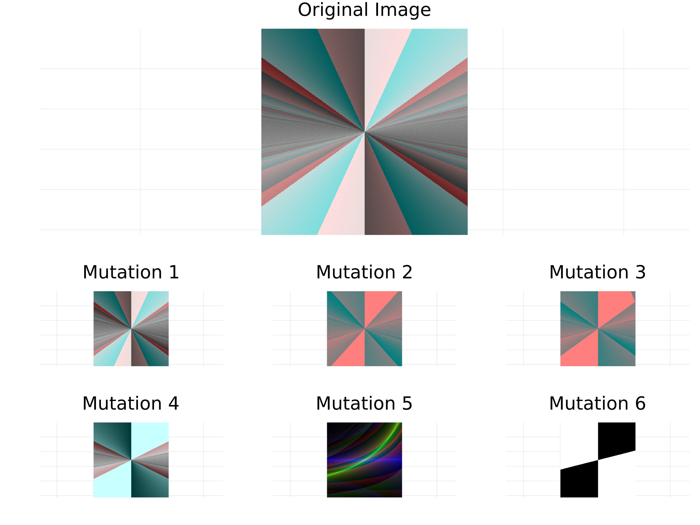
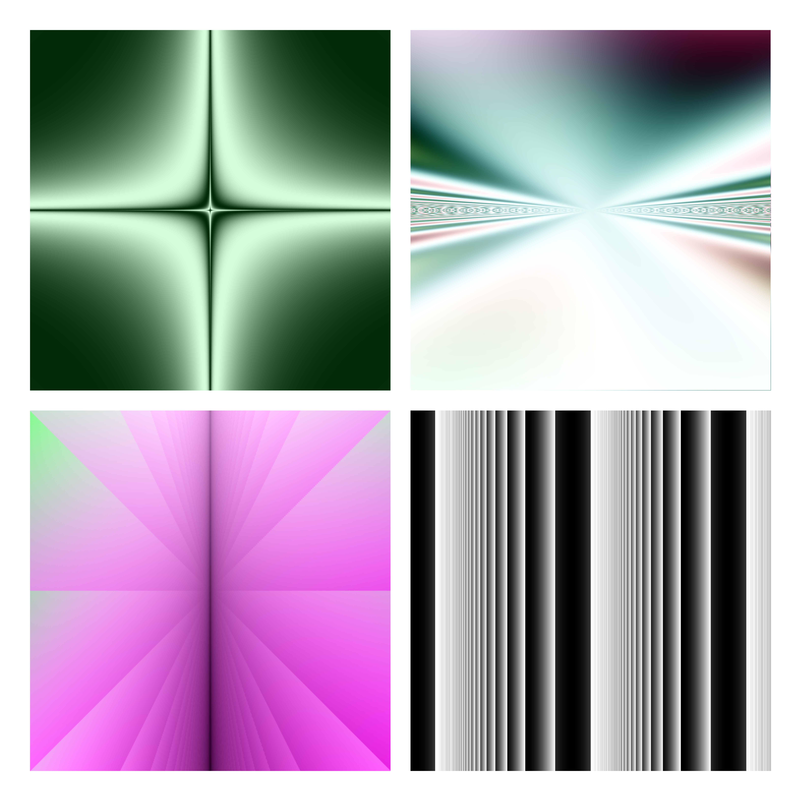

# GeneticTextures.jl

`GeneticTextures.jl` is a Julia package inspired by the paper [Artificial Evolution for Computer Graphics](https://dl.acm.org/doi/pdf/10.1145/127719.122752) by Karl Sims. It allows you to interactively evolve textures using genetic programming techniques, bringing the power of evolutionary algorithms to the world of computer graphics.

<div style="text-align: center;">
    
</div>

## Installation

To install GeneticTextures.jl, open your Julia REPL and type the following commands:

```julia
using Pkg
Pkg.add("https://github.com/jofrevalles/GeneticTextures.jl.git")
```

## Usage
```
using GeneticTextures

width = 128
height = 128
max_depth = 3

mutation_probs = Dict(
    :rand_expr => 0.06,
    :adjust_scalar => 0.1,
    :adjust_color => 0.1,
    :rand_func => 0.08,
    :add_argument => 0.1,
    :become_argument => 0.08,
    :duplicate_node => 0.03,
)

# Create initial population
original_population, original_image = generate_population(1, primitives_with_arity, max_depth)
population, images = create_variations(1, original_population, mutation_probs, primitives_with_arity, max_depth)

# Display original and mutated images
display_images(original_image[1], images)

# Interactively evolve textures
let population = population, images = images
    while true
        best_choice = get_user_choice(n)
        chosen_image = images[best_choice]

        if best_choice === nothing
            break
        end

        population, images = create_variations(best_choice, population, mutation_probs, primitives_with_arity, max_depth)
        display_images(chosen_image, images)
    end
end
```
<div style="text-align: center;">
    
</div>

## Examples
Here are some examples of textures generated with GeneticTextures.jl:

<div style="text-align: center;">
    
</div>

## Acknowledgments

GeneticTextures.jl makes use of the following third-party packages:

- CoherentNoise (MIT License)
- Colors (MIT License)
- ForwardDiff (MIT License)
- Images (MIT License)
- Plots (MIT License)
